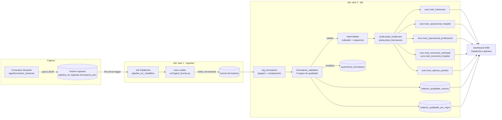

# Arquitetura

## Diagrama — fluxo ponta a ponta

## As 7 camadas obrigatórias, mapeadas neste projeto

| # | Camada | Onde está |
|---|---|---|
| 1 | **Ingestão** | `src/ingest_bronze.py` — Auto Loader lê o Volume `pipeline_tcc.ingestao.formularios_json` (fonte externa: formulário via app Streamlit), em modo incremental (`trigger=availableNow`). |
| 2 | **Armazenamento** | Unity Catalog, catalog `pipeline_tcc`, schemas `ingestao` (bruto, JSON original preservado) → `bronze` (Delta, 1:1 com o bruto) → `prata` → `ouro`. |
| 3 | **Transformação** | dbt: `models/staging` (tipagem/achatamento) → `models/intermediate` (cálculo do indicador + sequência temporal) → `models/prata` (consolidação) → `models/ouro` (marts finais). |
| 4 | **Orquestração** | Databricks Job `pipeline_tcc_medallion` (`resources/jobs.yml`), disparado automaticamente por *file arrival trigger* no volume de ingestão; duas tasks em sequência (ingestão → dbt), monitorável via Databricks Jobs UI/API. |
| 5 | **Qualidade** | `models/qualidade/`: `formularios_validados` (9 regras de validação linha a linha) → registros inválidos vão para `quarentena_formularios` (não seguem no pipeline) → `relatorio_qualidade_resumo` e `relatorio_qualidade_por_regra` (relatório de qualidade). |
| 6 | **Consumo** | Dashboard AI/BI (Databricks Lakeview), 2 páginas: "Visão Geral" (indicadores clínicos) e "Economia & Produto" (economia estimada + adoção). Lê diretamente as tabelas da camada Ouro. |
| 7 | **Infraestrutura e versão** | Todo o projeto (dbt, Job, Dashboard) é definido como código num Databricks Asset Bundle (`databricks.yml` + `resources/`), versionado no GitHub, com CI/CD (`.github/workflows/ci.yml`) validando em cada PR e fazendo deploy automático ao mergear na `main`. |

## Decisões técnicas principais

- **Databricks + Unity Catalog** como plataforma única (compute, storage, orquestração, BI) — simplifica o ambiente de um projeto de TCC sem infraestrutura própria pra manter.
- **Auto Loader** (não um `COPY INTO` manual) para a ingestão: garante idempotência (não reprocessa arquivo já lido) via checkpoint, sem precisar de lógica de deduplicação escrita à mão.
- **dbt** para toda a transformação: modelos versionados, testados (`dbt test`) e documentados como SQL declarativo, em vez de notebooks soltos.
- **Camada de qualidade como gate, não como validação decorativa**: registros que falham em qualquer uma das 9 regras não avançam para `intermediate`/`prata`/`ouro` — ficam isolados em `quarentena_formularios`, visíveis e auditáveis, sem travar o restante do pipeline nem contaminar os indicadores finais.
- **Databricks Asset Bundles** para empacotar Job + Dashboard como código, em vez de configurar recursos manualmente pela UI — permite `bundle validate`/`deploy` no CI/CD.
